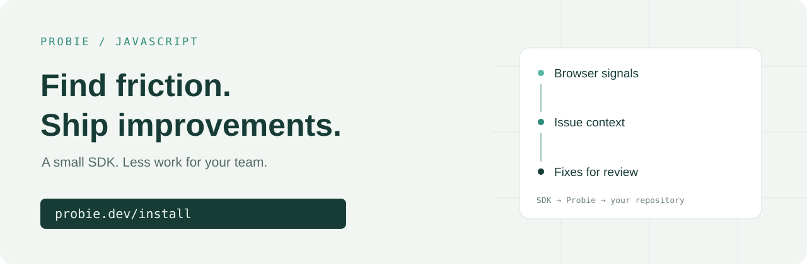

<p align="center">
  <a href="https://probie.dev"></a>
</p>

<h1 align="center">Probie for JavaScript</h1>
<p align="center">Probie automatically finds opportunities to improve your users’ experience.</p>
<p align="center">
  <a href="https://probie.dev">Probie</a> ·
  <a href="docs/README.md">Documentation</a> ·
  <a href="examples/README.md">Examples</a> ·
  <a href="CONTRIBUTING.md">Contribute</a>
</p>



[](LICENSE)
[](docs/api.md)
[](package.json)

Find the errors and frustrating interactions your users never report. Probie
connects signals from your web app to opportunities to improve it, then helps your
team investigate and prepare fixes for review.

Start with one script, keep your existing components, and let Probie capture errors,
failed requests, repeated clicks, and stuck interfaces automatically. Connect your
repository to get proposed fixes you can review before they ship.

**[Let us install Probie for you →](https://probie.dev/install)**

This is the official browser SDK for [Probie](https://probie.dev), available under
the MIT license. Investigation and proposed fixes are provided by the hosted
Probie service.

## Why choose Probie for JavaScript?

Choose it when you want a small, direct integration that helps you find user
friction and get a fix ready for review.

- **A small addition to your app.** The complete collector is about **7.1 kB
  minified and gzipped**, with **zero runtime dependencies**. Add a hosted script,
  or use the npm package with one `init` call; keep your existing components and routing.
- **Useful signals from the first session.** Errors, failed requests, click
  friction, form retries, and stuck interfaces are captured automatically. You
  do not need to instrument every button or define a custom event schema first.
- **Find problems that never throw an exception.** A loading indicator that never
  clears or a form users repeatedly retry can point to an improvement even when
  your error log is quiet.
- **Behavior signals without session recording.** Capture structured interaction
  events without installing a DOM replay recorder or collecting input values.
  See [exactly what is collected](docs/data-collection.md).
- **Less work between discovery and a fix.** Signals go directly to Probie for
  analysis. Connect your repository so Probie can investigate issues and propose
  fixes, with you in control of what ships.

The size above is measured on the current source as a minified ESM bundle targeting
ES2018, compressed with gzip. Run `npm run size` to reproduce it; your application's
build may differ. It is a download-size measurement, not a runtime benchmark.

## Quick start

**We can install Probie for you.** Go to [probie.dev/install](https://probie.dev/install)
to get started.

Prefer to install it yourself? Create a project in [Probie](https://probie.dev),
copy its public widget token from the integration page, and choose one method below.

### Option 1: Add a script — no npm or build step

Paste this before `</body>` to capture browser errors and interaction signals
without adding any visible UI:

```html
<script
  src="https://probie.dev/assets/probie-widget-events.js"
  data-token="YOUR_WIDGET_TOKEN"
></script>
```

That's it. Collection starts automatically when the script loads; no `init` call
is needed. This works with plain HTML and sites built with frameworks or site builders
that allow custom scripts.

**Want a feedback button too?** Use `probie-widget.js` instead:

```html
<script
  src="https://probie.dev/assets/probie-widget.js"
  data-token="YOUR_WIDGET_TOKEN"
></script>
```

The feedback widget automatically loads the collector. Include only one of these
snippets. Existing script installations keep working and do not need to migrate
to npm. See the [hosted script guide](docs/hosted-script.md) for configuration.

### Option 2: Use the npm package

Use this option to import the SDK into your app and manage its version through
your package manager. **Coming soon on npm.** Use the hosted script today.
The package setup will be:

```sh
npm install @probie-dev/web
```

Call `init` once in your browser entry point:

```ts
import { init } from "@probie-dev/web";

init({ token: "YOUR_WIDGET_TOKEN" });
```

Capture starts when `init` runs. Importing the package alone does not collect data.
The npm package provides the collector, without the feedback button.

Use one collector per page: the hosted script or the npm package. If your app uses
a consent choice, load the script or call `init` after that choice permits collection.
See [data collection](docs/data-collection.md) for the fields sent to Probie.

## Already use Sentry?

**Keep your existing setup. You can connect Sentry to Probie without installing
this SDK.** In Probie, open **Settings → Integrations** and use the **Sentry
Webhook** connection to send issue alerts into Probie. Connect your repository to
use Probie's investigation and proposed-fix workflow.

The JavaScript SDK adds a direct source of browser behavior for Probie, including
form retries, stuck loading states, and failed overlay dismissals. You can add it
alongside your Sentry alert connection, or use it as your initial source of
browser signals.

| Your goal | Start with |
| --- | --- |
| Bring existing Sentry issues into Probie | Connect the Sentry webhook; this SDK is optional |
| Give Probie browser errors and interaction signals directly | Add the hosted script or use `@probie-dev/web` |
| Keep Sentry alerts and add Probie's automatic friction capture | Use the Sentry connection and this SDK together |

The reason to choose this SDK is its focused setup and direct connection to
Probie's workflow. Your existing monitoring tools can continue serving the rest
of your stack. For a provider other than Sentry, contact
[hello@probie.dev](mailto:hello@probie.dev) to check available integration options.

## What it captures

| Signal | What you can investigate |
| --- | --- |
| JavaScript errors | Uncaught errors and unhandled promise rejections, with available stack traces |
| Failed requests | Fetch and XHR failures, HTTP status, method, URL, and duration |
| Click friction | Repeated clicks and clicks with no detected response |
| Form friction | Submissions, retries, and abandonment, without input values |
| Stuck interfaces | Persistent loading indicators, failed overlay dismissal, and scroll locks |
| Navigation | Page views, path changes, visible time, and scroll depth |

Friction signals are heuristics. Review the surrounding evidence before treating
one as a confirmed bug.

## Use it with your framework

The same browser package works with client-rendered apps and browser components in
server-rendered apps. It does not capture server-side errors.

| Environment | Setup |
| --- | --- |
| Plain HTML / custom script embed | [Hosted script, no build step](docs/hosted-script.md) |
| JavaScript / Vite | [Browser entry point](docs/frameworks.md#javascript-and-vite) |
| React | [Root component](docs/frameworks.md#react) |
| Next.js App Router | [Client component](docs/frameworks.md#nextjs-app-router) |
| Wasp / Open SaaS | [Integration guide](docs/open-saas.md) |

ES modules, CommonJS, TypeScript declarations, and source maps are included. The
browser build targets ES2018. See [compatibility and limitations](docs/compatibility.md).

## Versions and updates

The npm package uses numbered releases. Commit your lockfile to keep deployments
reproducible; use `npm install --save-exact @probie-dev/web` if you also want an
exact version in `package.json`. During 0.x, patch releases preserve compatibility
and minor releases may include documented breaking changes.

The hosted script URLs receive updates from Probie and are not version-pinned.
Choose npm when you need control over upgrade timing. See the
[versioning policy](docs/versioning.md) for release channels, upgrades, and the
hosted script update policy.

## Associate events with a user

With the npm package, use an opaque application user ID. Call `reset` when that
user logs out.

```ts
import { identify, reset } from "@probie-dev/web";

identify("user_123");
// When the user logs out:
reset();
```

Identity applies to future events. `reset` clears identity and rotates the session;
it does not stop capture. [Read the API reference](docs/api.md).

## Know what leaves the browser

The collector does not record form input values, request bodies, or response
bodies. Element labels are hashed before transmission. URL fragments are removed;
query parameters are removed by default except for six supported UTM parameters.

Error messages, stack traces, URL paths, DOM attributes, user IDs, and manual event
payloads can still contain sensitive data. Hashing is not anonymization. Review
[data collection and controls](docs/data-collection.md) before enabling capture.

## Try the local example

You can inspect event batches without a Probie account:

```sh
npm ci
npm run demo
```

Open `http://127.0.0.1:4173/examples/browser/`. The local receiver displays the
captured events. It does not send them to Probie. [Example details](examples/README.md).

## Documentation and support

- [Hosted script](docs/hosted-script.md): install without npm, with an optional feedback button.
- [API reference](docs/api.md): initialization, identity, manual events, and delivery.
- [Framework guides](docs/frameworks.md): React, Next.js, and Vite.
- [Troubleshooting](docs/troubleshooting.md): missing events, CSP, and duplicate initialization.
- [Changelog](CHANGELOG.md): release history and migration notes.
- [Versioning](docs/versioning.md): compatibility, pinned installs, and hosted updates.
- [Contributing](CONTRIBUTING.md): local setup, tests, and pull requests.
- [Security](SECURITY.md): report a vulnerability privately.

For reproducible SDK bugs, [open an issue](https://github.com/ProbieAI/probie-web/issues).
For account or service questions, contact [hello@probie.dev](mailto:hello@probie.dev).

## License

[MIT](LICENSE). The SDK can be inspected, modified, and redistributed under that
license. Use of the hosted Probie service requires a Probie account.
